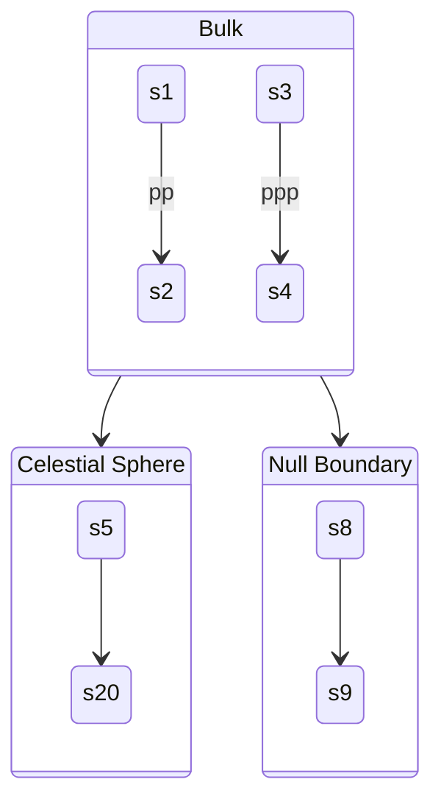

```mermaid
stateDiagram-v2
	S1 : Celestial Sphere
	S2 : Null Boundary

	Bulk --> S1
	Bulk --> S2

	
	state Bulk {
	s1-->s2:pp
	s3-->s4:ppp
	}

	state S1 {
	s5-->s20
	}
	state S2 {
	s8-->s9
	}
	
```

# Basic Introductory Literature

# Terminology, Notation and Conventions

## Terminology

|     |     |
| --- | --- |
|     |     |
|     |     |

## Notation

## Conventions

#Physics/Holography 